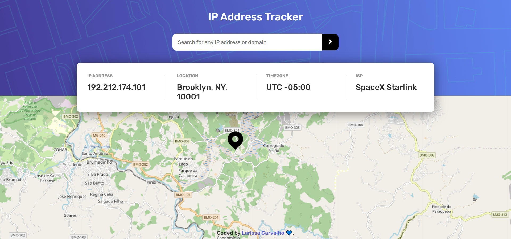

# IP Address Tracker 

O IP Address Tracker é um aplicativo que possibilita obter as principais informações e localizações através do seu IP ou domínio do site. 

## Índice

- [Visão Geral](#visão-geral)
  - [Desafio](#desafio)
  - [Screenshot](#screenshot)
  - [Links](#links)
- [Meu Processo](#meu-processo)
  - [Criado com](#criado-com)
  - [Desenvolvimento Contínuo](#desenvolvimento-contínuo)
- [Autor](#autor)

## Visão Geral

### Desafio

Seus usuários devem ser capazes de:

- Visualize o layout ideal para cada página, dependendo do tamanho da tela do dispositivo
- Veja os estados de foco para todos os elementos interativos na página
- Veja seu próprio endereço IP no mapa no carregamento da página inicial
- Pesquise quaisquer endereços IP ou domínios e veja as principais informações e localização

### Screenshot

### Links

- Solução URL: [https://github.com/LarissaCalmeida/IP-Address-Tracker](https://github.com/LarissaCalmeida/IP-Address-Tracker)
- Live Site URL: [http://ip-address-tracker-three-self.vercel.app/](http://ip-address-tracker-three-self.vercel.app/)

## Meu Processo

### Criado com

- HTML5
- CSS3
- Flexbox
- AJAX
- [JQuery](https://jquery.com/) - JavaScript Library
- [IP Geolocation IPify](https://geo.ipify.org/) - API
- [LeafletJS](https://leafletjs.com/) - JavaScript Library

### :rocket: Desenvolvimento Contínuo

Nos próximos projetos irei me concentrar mais na área do JavaScript e API's, para poder refinar os conhecimentos e aperfeiçoar as técnicas.

## Autor

- Instagram - [@lari.code](https://www.instagram.com/lari.code/)
- Frontend Mentor - [@Larissa0478](https://www.frontendmentor.io/profile/Larissa0478)
- LinkedIn - [Larissa Carvalho](https://www.linkedin.com/in/larissa-carvalho-7149101b8/)

